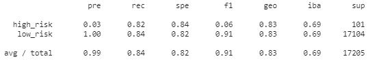
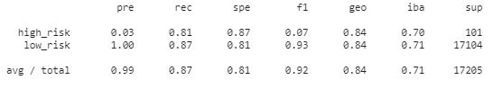
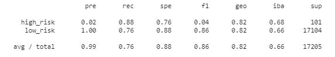
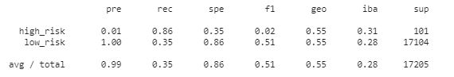
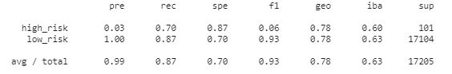
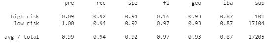

# Risky Business

## Background

Auto loans, mortgages, student loans, debt consolidation ... these are just a few examples of credit and loans that people are seeking online. Peer-to-peer lending services such as LendingClub or Prosper allow investors to loan other people money without the use of a bank. However, investors always want to mitigate risk, so you have been asked by a client to help them use machine learning techniques to predict credit risk.

In this project, you will build and evaluate several machine-learning models to predict credit risk using free data from LendingClub. Credit risk is an inherently imbalanced classification problem (the number of good loans is much larger than the number of at-risk loans), so you will need to employ different techniques for training and evaluating models with imbalanced classes. You will use the imbalanced-learn and Scikit-learn libraries to build and evaluate models using the two following techniques:

  

---

### Files

[Resampling Starter Notebook](Starter_Code/credit_risk_resampling.ipynb)

[Ensemble Starter Notebook](Starter_Code/credit_risk_ensemble.ipynb)

[Lending Club Loans Data](Instructions/Resources/LoanStats_2019Q1.csv.zip)

---

## Resampling

You will use the [imbalanced learn](https://imbalanced-learn.readthedocs.io) library to resample the LendingClub data and build and evaluate logistic regression classifiers using the resampled data.

You will:

1. Load the Lending Club data, split the data into training and testing sets. 

        from sklearn.model_selection import train_test_split

        X_train, X_test, y_train, y_test = train_test_split(X, y, random_state=1)

2. Scale the features data.

        from sklearn.preprocessing import StandardScaler
        scaler = StandardScaler()

3. Oversample the data using the `Naive Random Oversampler` algorithms.

        from imblearn.over_sampling import RandomOverSampler

        ros = RandomOverSampler(random_state=1)
        X_resampled, y_resampled = ros.fit_resample(X_train_scaled, y_train)

4. Oversample the data using the  `SMOTE` algorithms.

        from imblearn.over_sampling import SMOTE

        X_resampled, y_resampled = SMOTE(random_state=1, sampling_strategy=1.0).fit_resample(X_train_scaled, y_train)

   
5. Undersample the data using the `Cluster Centroids` algorithm.

        from imblearn.under_sampling import ClusterCentroids

        cc = ClusterCentroids(random_state=1)
        X_resampled, y_resampled = cc.fit_resample(X_train_scaled, y_train)

6. Over- and under-sample using a combination `SMOTEENN` algorithm.

        X_resampled, y_resampled = SMOTE(random_state=1, sampling_strategy=1.0).fit_resample(X_train, y_train)

For each of the above, you will need to:

7. Train a `logistic regression classifier` from `sklearn.linear_model` using the resampled data.

        model = LogisticRegression(solver='lbfgs', random_state=1)
        model.fit(X_resampled, y_resampled)

8. Calculate the `balanced accuracy score` from `sklearn.metrics`.

        y_pred = model.predict(X_test_scaled)
        balanced_accuracy_score(y_test, y_pred)

9.  Calculate the `confusion matrix` from `sklearn.metrics`.

        confusion_matrix(y_test, y_pred)
        
10. Print the `imbalanced classification report` from `imblearn.metrics`.

    **Random Sampling**

    

    **Smote Over Sampling**
    

    **Under Sampling**
    

    **Combination Sampling**
    

## Ensemble Learning

In this section, you will train and compare two different ensemble classifiers to predict loan risk and evaluate each model. You will use the [Balanced Random Forest Classifier](https://imbalanced-learn.readthedocs.io/en/stable/generated/imblearn.ensemble.BalancedRandomForestClassifier.html#imblearn-ensemble-balancedrandomforestclassifier) and the [Easy Ensemble Classifier](https://imbalanced-learn.readthedocs.io/en/stable/generated/imblearn.ensemble.EasyEnsembleClassifier.html#imblearn-ensemble-easyensembleclassifier). Refer to the documentation for each of these to read about the models and see examples of the code.

Be sure to complete the following steps for each model:

1. Load the Lending Club data, split the data into training and testing sets, and scale the features data.

        from sklearn.model_selection import train_test_split

        X_train, X_test, y_train, y_test = train_test_split(X, y, random_state=1)
2. Train the model using the quarterly data from LendingClub provided in the `Resource` folder.

        from imblearn.ensemble import BalancedRandomForestClassifier

        model = BalancedRandomForestClassifier(n_estimators=100, random_state=1)
        model = model.fit(X_train_scaled, y_train)

3. Calculate the balanced accuracy score from `sklearn.metrics`.

        y_pred = model.predict(X_test_scaled)
        balanced_accuracy_score(y_test, y_pred)

4. Print the confusion matrix from `sklearn.metrics`.
5. Generate a classification report using the `imbalanced_classification_report` from imbalanced learn.
**Balanced Random Forest Classifier**

    **Easy Ensemble Classifier**

6. For the balanced random forest classifier only, print the feature importance sorted in descending order (most important feature to least important) along with the feature score.

        importances = model.feature_importances_
        importances_sorted = sorted(zip(model.feature_importances_, X.columns), reverse=True)

------
You should now be able to answer the following:

> Which model had the best balanced accuracy score?
>
> Which model had the best recall score?
>
> Which model had the best geometric mean score?
>
> What are the top three features?

---

## Resources

Use the quarterly data from the LendingClub data that is provided in the `Resources` folder. Keep the file in the zipped format and use the starter code to read the file.

Refer to the [imbalanced-learn](https://imbalanced-learn.readthedocs.io/en/stable/) and [scikit-learn](https://scikit-learn.org/stable/) official documentation for help with training the models. Remember that these models all use the model->fit->predict API.

For the ensemble learners, use 100 estimators for both models.

Loan Data Analysis and Visualization using Lending Club Data [Data Science Blog](https://nycdatascience.com/blog/r/p2p-loan-data-analysis-using-lending-club-data/)

Decision Trees and Random Forests [Towards Data Science](https://towardsdatascience.com/decision-trees-and-random-forests-df0c3123f991)

Decision Trees and Random Forests [Medium.com](https://medium.com/datadriveninvestor/decision-tree-and-random-forest-e174686dd9eb)

---

