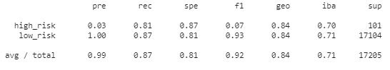

# Summary Report

## Credit Risk Resample:
Random Over Sampling
 
Smote Over Sampling
 
Under Sampling
 
Combination Sampling

1. Which model had the best balanced accuracy score?
The Best Balanced Accuracy Score is in SMOTE Oversampling Model with 84%

2. Which model had the best recall score?
I will choose SMOTE Oversampling Model for Recall Score, even though Undersampling provides higher Recall score for high-risk applications but it will compromise Recall Score for low-risk applications.

3. Which model had the best geometric mean score?
The Best Model for Geometric Mean Score is the SMOTE Oversampling Model.

## Credit Risk Ensample:
Balanced Random Forest Classifier

Easy Ensemble Classifier

1. Which model had the best balanced accuracy score?
Easy Ensemble Model is perect in balanced accuracy score with 93% 

2. Which model had the best recall score?
Easy Ensemble Model has the best recall score for high and low risk loan applications.

3. Which model had the best geometric mean score?
Easy Ensemble Model 

4. What are the top three features?

   * 0.0787    : 'total_rec_prncp'
   * 0.0588    : 'total_pymnt'
   * 0.0562    :  'total_pymnt_inv'

